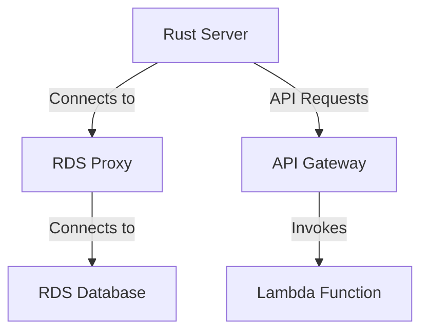

# Yes
Why not

## Getting Started

### Prerequisites

* Install Rust: https://www.rust-lang.org/tools/install
* Install Terraform: https://learn.hashicorp.com/tutorials/terraform/install-cli
* Install AWS CLI: https://docs.aws.amazon.com/cli/latest/userguide/install-cliv2.html

### Setup

* Clone the repository: `git clone https://github.com/tomMoulard/Yes.git`
* Navigate to the project directory: `cd Yes`
* Build the backend: `make build`
* Run the backend: `make dev`
* Deploy the infrastructure using Terraform:
  * Initialize Terraform: `terraform init`
  * Apply the Terraform configuration: `terraform apply`

### Running Migrations

* To run the database migrations, use the following command: `make migrate-db`

### Usage

* Access the API at the provided API Gateway URL.

## Infrastructure Diagram

## TODO

 - user id as UUID
 - use authentication middleware that plugs in the webserver to wrap the
 request handler and inject user data into the request.
 - actually make a payement (lol)
 - fix frontend/backend tests
 - /login does not require the whole user data, only user/password
 - allow CORS in backend for frontend
